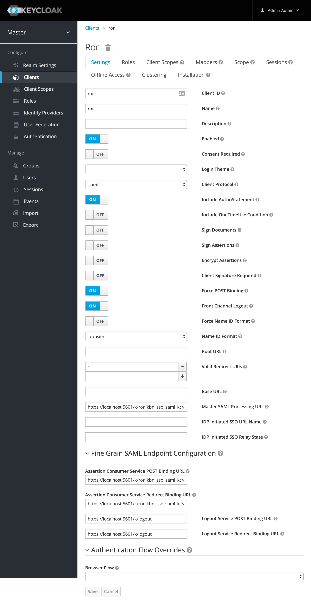

# ReadonlyREST Enterprise + Keycloak integration via SAML SSO

This document will guide you through the task of setting up an excellent, open source  identity provider ([KeyCloak](https://www.keycloak.org)) to work as an external authenticator and authorizer system for your ELK stack.
The scenario is the usual:

* A centralised, large Elasticsearch cluster
* A Kibana installation
* We want one, centralised multi tenant Elasticsearch + Kibana 

But with some more enterprisy requirements:

* Users need to be able to change their passwords independently
* Users need to verify their emails
* Group managers need to be able to add, remove, block (only) their users.
* [Multi factor authentication (MFA)](https://www.keycloak.org/docs/3.2/server_admin/topics/authentication/otp-policies.html) is a requirement.


## What is Keycloak

Keycloak is an advanced authentication server that lets user administer their credentials, and speaks many authentication protocols, Including SAML2.0 SSO.


### Setup KeyCloak
This tutorial was created using KeyCloak 6.0.1. 

1. Download the standalone version of Keycloak from their official website
2. Run Keycloak: run `bin/standalone.sh` or equivalent for your platform.
3. Navigate to http://localhost:8080 and configure the admin user's credentials **don't forget to fill the email address!**.
4. Login as admin
5. Use the import function to load this [configuration file](keycloak_601_ror_SAML.json)

You should now have setup a SAML client called "ror" (keep this ID or change the "issuer" setting in kibana.yml) in the "master" realm.



### Install ReadonlyREST Enterprise for Kibana

Please refer to our [documentation](https://github.com/beshu-tech/readonlyrest-docs/blob/master/kibana.md) on how to obtain and install ReadonlyREST Enterprise for Kibana. 
Also remember that it relies on the Elasticsearch plugin to be configured as well.


### Setup the SAML connector 
Provided that you have ReadonlyREST Enterprise installed configured, you can add the following configuration:

**kibana.yml**
```yml
readonlyrest_kbn:
  logLevel: "debug"
  auth:
    signature_key: "my_shared_secret_kibana1_(min 256 chars)my_shared_secret_kibana1_(min 256 chars)my_shared_secret_kibana1_(min 256 chars)my_shared_secret_kibana1_(min 256 chars)" # <- use environmental variables for better security!
    saml_kc:
      buttonName: "KeyCloak SAML SSO"
      enabled: true
      type: "saml"
      issuer: "ror"
      entryPoint: "http://127.0.0.1:8080/auth/realms/master/protocol/saml"
      kibanaExternalHost: 'localhost:5601' 
      protocol: "http"
      usernameParameter: "nameID"
      groupsParameter: "Role"
      logoutUrl: "http://127.0.0.1:8080/auth/realms/master/broker/saml/endpoint"
 ```
 
 Don't forget setting up SAML requires some changes to security settings in `readonlyrest.yml` (on the elasticsearch side). Security settings can also be changed via the ReadonlyREST Kibana app.
 
 
